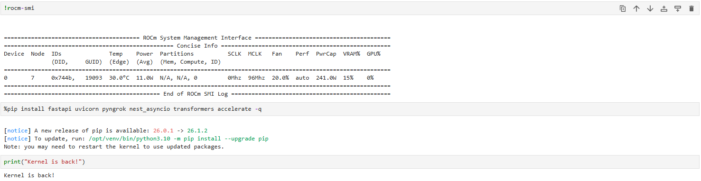
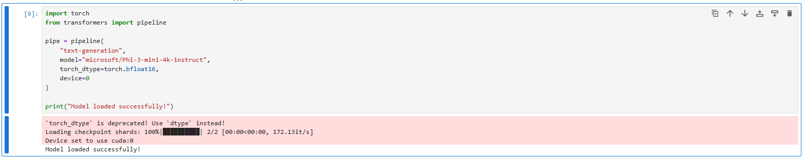
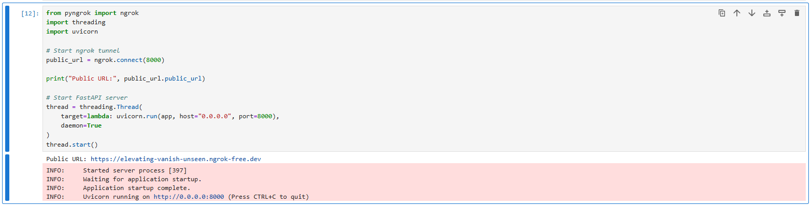
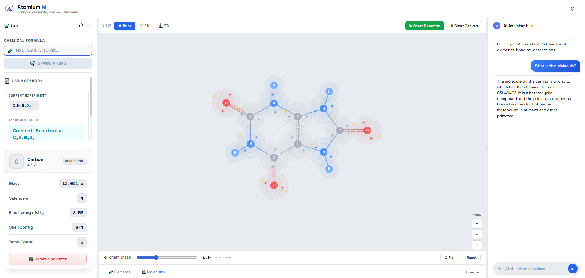
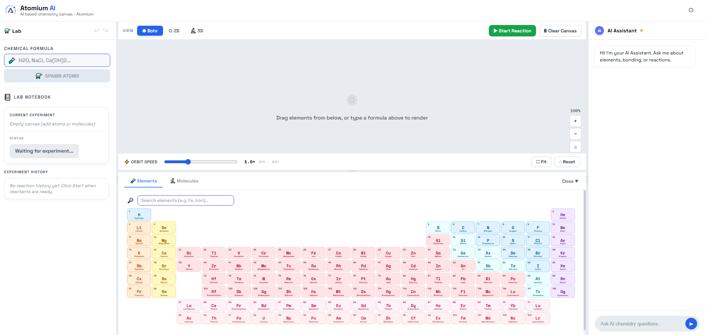
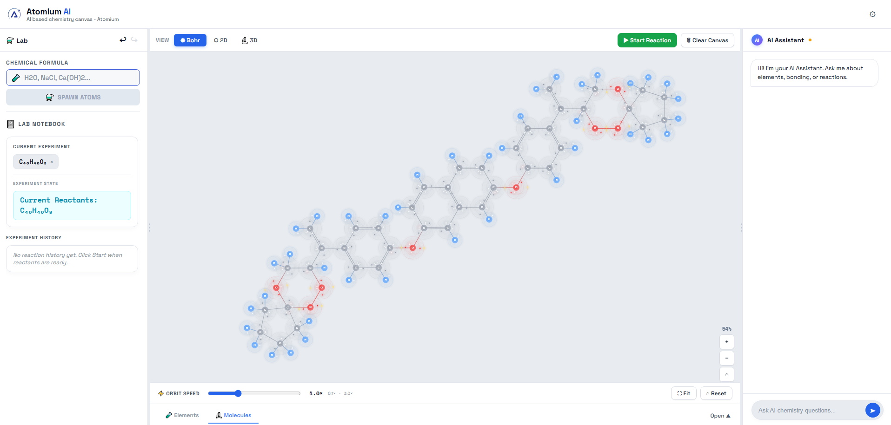
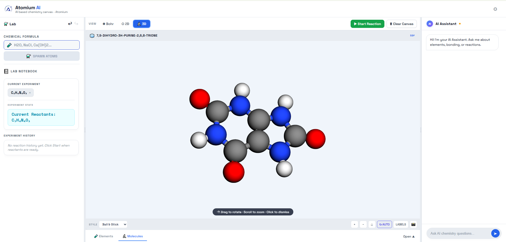

# Atomium 🧪

> An AI-powered interactive virtual chemistry laboratory that makes chemistry visual, interactive, and easier to understand.

---

## Overview

Atomium is an advanced, interactive virtual chemistry laboratory designed to revolutionize how students and enthusiasts learn chemistry. Instead of relying on static textbook equations, Atomium provides a dynamic, physics-based sandbox where users can drag and drop atoms, form bonds, build complex molecules, and simulate real chemical reactions. Powered by AI and a robust physics engine, it bridges the gap between abstract chemical concepts and tangible, visual understanding.

## Problem Statement

Traditional chemistry education often struggles with several key limitations:
1. **Memorization-Heavy Learning:** Students are forced to memorize formulas and reactions without understanding the underlying mechanics.
2. **Abstract Visualization:** It is difficult to visualize molecules, electron shells, and how bonds actually form in 3D space.
3. **Lack of Interactive Experimentation:** Real labs are expensive, dangerous, and inaccessible. Students rarely have a safe sandbox to just "mix things and see what happens."

## Solution

Atomium solves these problems by providing a comprehensive, interactive learning environment:
- **Interactive Molecule Building:** Construct molecules visually by dragging atoms together.
- **Atom-Level Visualization:** See electron shells and atomic structures in real-time.
- **Simulated Chemical Reactions:** Mix molecules and watch them react according to real chemical rules.
- **AI-Assisted Learning:** An integrated AI acts as a lab assistant to predict reactions and explain complex concepts.
- **Multi-Dimensional Views:** Switch between 2D structural representations and interactive 3D models.

---

## Key Features

### 1. Periodic Table Integration
- **Selecting Elements:** Access a comprehensive interactive periodic table to select elements.
- **Workspace Integration:** Easily spawn atoms onto the canvas for experimentation.
- **Element Inspector:** View detailed properties (atomic mass, electronegativity, electron configuration) for any selected element.

### 2. Atom Drag & Drop System
- **Physics-Based Interaction:** Drag atoms freely around the canvas.
- **Spring-Drag Physics:** When dragging bonded molecules, the system uses Hooke's Law spring physics and velocity damping to simulate a realistic, "gooey" elastic feel.
- **Shape Restoration:** Upon releasing a molecule, it smoothly snaps back to its chemically optimal shape.

### 3. Molecular Bond Formation
- **Intuitive Bonding:** Bring atoms close together to form covalent or ionic bonds based on their chemical properties.
- **Dynamic Structural Visualization:** The layout engine automatically arranges bonded atoms into geometrically accurate molecular structures (e.g., linear, bent, tetrahedral).

### 4. Formula Input System
- **Canonical Parsing:** Type formulas (e.g., `H2O`, `Fe2O3`, `C16H19N3O5S`) directly into the UI.
- **Hill System Normalization:** The system automatically normalizes formulas using established chemical conventions (IUPAC/Hill system) for consistent rendering and database querying.

### 5. Reaction Engine
- **Reactant Handling:** The engine detects proximity between different molecules to trigger potential reactions.
- **Product Generation:** Based on a curated database and AI prediction, it breaks reactant bonds and forms new product molecules.
- **Equation Display:** Dynamically generates and displays balanced chemical equations for the observed reactions.

### 6. Electron Visualization (Bohr Mode)
- **Electron Movement:** View animated electron shells orbiting the nucleus.
- **Bond Visualization:** See how electrons are shared (covalent) or transferred (ionic) during bond formation, providing deep educational value.

### 7. 2D Molecular Structure View
- **Structural Clarity:** A clean, simplified 2D view (Lewis-style) focusing on bond orders (single, double, triple) and molecular connectivity.

### 8. 3D Molecular Visualization
- **Spatial Understanding:** Seamlessly switch to a 3D viewer (powered by `3dmol.js`) to rotate, zoom, and inspect the true spatial geometry of the generated molecules.

### 9. AI Chemistry Assistant
- **AMD Developer Cloud Integration:** Powered primarily by Microsoft Phi-3 Mini 4K Instruct hosted on AMD Developer Cloud using AMD ROCm acceleration.
- **Automatic Fallback:** Includes a transparent fallback to Fireworks AI (Qwen models) if the primary AMD Developer Cloud endpoint is offline or times out.
- **Configurable Endpoint:** The primary AMD endpoint is fully configurable via the `VITE_AMD_API_ENDPOINT` environment variable.
- **Reaction Prediction:** Automatically predicts valid, real-world chemical reactions for elements/molecules on the workspace when no database records exist.
- **Safety Boundaries:** The AI is constrained to safe, educational chemistry and will refuse to assist with harmful or out-of-scope requests.

### 10. Lab Notebook (Supabase Persistence)
- **Experiment Tracking:** Successfully discovered and AI-predicted reactions are persisted to a Supabase PostgreSQL database.
- **Continuous Learning:** The global reaction database grows as users discover new valid reactions, making them instantly available for future sessions.

---

## Demo Workflow

A typical user journey in Atomium:
1. **Open Virtual Lab:** Launch the application and enter the interactive canvas.
2. **Select Elements:** Open the Periodic Table and drag Hydrogen and Oxygen onto the workspace.
3. **Build Molecules:** Drag the atoms together to form `H₂` and `O₂` molecules.
4. **Formula Input:** Alternatively, type `Na` and `Cl` into the formula bar to instantly spawn them.
5. **Start Reaction:** Bring `2H₂` and `O₂` close together to trigger a reaction.
6. **Observe Changes:** Watch the bonds break and reform to create `2H₂O`.
7. **Analyze Structure:** Toggle between Bohr (electron), 2D (structural), and 3D views to analyze the resulting water molecules.
8. **Ask AI:** Open the chat panel and ask, "Why is water a bent molecule?"
9. **Save Experiment:** The new reaction is automatically recorded in the Lab Notebook database.

---

## Supported Chemistry Examples

Atomium supports a wide range of chemistry, from basic synthesis to complex organic structures.

**Simple Synthesis:**
`2H₂ + O₂ → 2H₂O`

**Single/Double Displacement:**
`Cu + 2AgNO₃ → Cu(NO₃)₂ + 2Ag`
`HCl + NaOH → NaCl + H₂O`

**Complex Molecular Support:**
The engine can parse, render, and view 3D structures for complex molecules like:
`C₁₆H₁₉N₃O₅S` (Amoxicillin)

---

## Technical Architecture

- **Frontend Technology:** React 18, Vite, standard CSS.
- **Backend/Database:** Supabase (PostgreSQL) for storing reaction blueprints and user discoveries.
- **AI Integration (Primary):** Microsoft Phi-3 Mini 4K Instruct hosted on **AMD Developer Cloud** with **AMD ROCm** hardware acceleration, exposed via a **FastAPI** service and **ngrok** tunnel.
- **AI Integration (Fallback):** **Fireworks AI API** (Qwen models) acting as an automatic, transparent fallback if the AMD endpoint is unreachable.
- **Backend/Model Deployment Stack:** Hugging Face Transformers, PyTorch, ROCm, FastAPI, ngrok.
- **Chemistry Engine:** A custom-built JavaScript engine (`src/chemistry/`) that handles formula parsing, canonicalization (Hill system), molecular graph traversal, and reaction resolution.
- **Physics/Rendering:** Custom HTML5 Canvas rendering loop with Verlet integration for spring-drag physics and pairwise atom repulsion.
- **3D Rendering:** `3dmol.js` integrated for visualizing generated SDF/XYZ molecular data.

### Data Flow
1. User input (drag-drop or formula) generates runtime Atom/Bond objects.
2. The `reactionEngine` checks proximity and groups colliding molecules.
3. The `reactionStore` checks the local cache and Supabase DB for known reactions.
4. If missing, `aiReactionPredictor` queries the LLM for a valid chemical outcome.
5. `reactionAdapter` converts DB/AI JSON into executable graph transformations.
6. The Canvas updates visually, and `reactionPersistence` saves new AI discoveries back to Supabase.

---

## AMD Developer Cloud Integration

ChemLabAI runs a high-performance, local LLM inference pipeline integrated directly into the workspace:
- **Model:** Microsoft Phi-3 Mini 4K Instruct, an open-source, highly efficient model optimized for reasoning.
- **Hardware & Acceleration:** Hosted on the **AMD Developer Cloud** powered by AMD GPUs and accelerated using the **AMD ROCm** software stack.
- **Inference Service:** Served via a lightweight **FastAPI** service running Hugging Face Transformers.
- **Connectivity:** Exposed securely to the client application via an **ngrok** tunnel.
- **Automatic Fallback:** Includes a transparent fallback mechanism that automatically redirects requests to **Fireworks AI** (Qwen models) if the AMD Developer Cloud endpoint is unavailable or times out.

### Architecture Diagram

```
ChemLabAI
     ↓
FastAPI (/generate)
     ↓
Microsoft Phi-3 Mini 4K Instruct
     ↓
AMD Developer Cloud (ROCm GPU)

Automatic fallback:
Fireworks AI
```

### Integration Evidence

Below are screenshots demonstrating the active AMD Developer Cloud integration and infrastructure setup:

#### 1. ROCm GPU Verification

*AMD ROCm GPU verification showing active GPU and ROCm SMI status.*

#### 2. Model Loaded in GPU Memory

*Microsoft Phi-3 Mini 4K Instruct loaded successfully on AMD GPU memory.*

#### 3. FastAPI & ngrok Tunnel

*FastAPI inference service exposing the /generate endpoint securely via ngrok.*

#### 4. ChemLabAI AI Assistant

*ChemLabAI chat assistant generating molecular data utilizing the AMD Developer Cloud hosted model.*

---

## Installation & Setup

### Prerequisites
- Node.js (v18 or higher recommended)
- npm or yarn
- A Supabase account (for database features)
- An AMD Developer Cloud endpoint (or fallback to Fireworks)
- A Fireworks AI API Key (optional, for transparent fallback features)

### Environment Variables
Create a `.env` file in the root directory:
```env
VITE_SUPABASE_URL=your_supabase_project_url
VITE_SUPABASE_ANON_KEY=your_supabase_anon_key
VITE_AMD_API_ENDPOINT=https://elevating-vanish-unseen.ngrok-free.dev/generate
VITE_FIREWORKS_API_KEY=your_fireworks_api_key
VITE_FIREWORKS_MODEL=accounts/fireworks/models/qwen3p7-plus
```

### Installation
```bash
# Clone the repository
git clone https://github.com/shreebhandare/Atomium.git

# Navigate to the project directory
cd AtomiumAI

# Install dependencies
npm install
```

### Running the Application
```bash
# Start the Vite development server
npm run dev
```
### Running with Docker

Atomium can be easily run using Docker. The multi-stage Dockerfile builds the static assets and serves them via an Nginx container.

Ensure you have your `.env` file configured in the root directory before building.

**Using Docker Compose (Recommended):**
```bash
# Build the image and start the container in detached mode
docker compose up --build -d

# The application will be available at http://localhost:8080
```

**Using Standard Docker Commands:**
```bash
# Build the Docker image
docker build \
  --build-arg VITE_SUPABASE_URL=your_url \
  --build-arg VITE_SUPABASE_ANON_KEY=your_key \
  --build-arg VITE_AMD_API_ENDPOINT=https://elevating-vanish-unseen.ngrok-free.dev/generate \
  --build-arg VITE_FIREWORKS_API_KEY=your_key \
  --build-arg VITE_FIREWORKS_MODEL=your_model \
  -t Atomium-ai .

# Run the container
docker run -d -p 8080:80 --name Atomium-ui Atomium-ai

# The application will be available at http://localhost:8080
```

---

## Project Structure

```
AtomiumAI/
├── src/
│   ├── components/         # React UI components (Sidebar, Chat, Canvas wrapper, etc.)
│   ├── chemistry/          # Core chemistry engine (physics, reactions, molecules)
│   ├── lookup/             # External services (Supabase DB, AI Predictor, PubChem)
│   ├── data/               # Static chemical data (Elements, Periodic Table)
│   ├── formulaParser.js    # Chemical formula parsing and Hill system normalization
│   ├── layoutEngine.js     # 2D molecular geometry and layout calculation
│   ├── AtomiumCanvas.jsx   # Main physics and rendering loop
│   └── main.jsx            # React entry point
├── supabase_migration.sql  # Database schema for Supabase
├── package.json            # Dependencies and scripts
└── vite.config.js          # Vite configuration
```

---

## How It Works Internally

- **Atom Representation:** Atoms are lightweight JavaScript objects containing position (`x`, `y`), velocity (`vx`, `vy`), symbol, and electron shell data.
- **Molecule Representation:** Molecules are defined dynamically by a graph of Atoms connected by Bond objects.
- **Bond Handling:** Bonds exert Hooke's Law spring forces between atoms in the physics loop, keeping molecules together while allowing them to flex and rotate.
- **Reaction Processing:** When molecules collide, the engine checks their canonical signature against known reactions. If a match is found, old bonds are destroyed, new atoms/bonds are spawned, and an exothermic "burst" animation plays.
- **AI Interaction Flow:** The chat panel maintains context of the canvas state. Reaction predictions bypass the chat and query the LLM with strict JSON-schema prompts to ensure parsable, chemically valid outputs.

---

## AI Safety & Scope

- **Specialized Focus:** The AI integrations (both chat and reaction prediction) are strictly prompted to act as educational chemistry assistants.
- **Safety Guardrails:** The system is designed to refuse assistance with creating dangerous, illegal, or harmful chemical substances (e.g., explosives, illicit drugs).
- **Educational Boundary:** The AI will generally decline to answer questions unrelated to chemistry or the current simulation, keeping the focus on learning.

---

## Future Roadmap

- **Expanded Reaction Database:** Continuously grow the pre-verified reaction database.
- **Advanced Thermodynamics:** Simulate temperature and pressure effects on reaction rates and states of matter.
- **Reaction Mechanisms:** Visualize step-by-step electron pushing (arrow pushing) for organic chemistry mechanisms.
- **Expanded Educational Content:** Built-in guided lessons and curriculum-aligned lab experiments.

---

## Screenshots / Demo

### 🧪 Periodic Table & Elements Canvas


### 🔬 Drag & Drop Molecular Workspace


### 🔮 3D Molecule Visualizer


### 🤖 AI Chemistry Assistant in Action


---

## Contributing

We welcome contributions from developers, chemists, and educators! 
1. Fork the repository
2. Create your feature branch (`git checkout -b feature/AmazingFeature`)
3. Commit your changes (`git commit -m 'Add some AmazingFeature'`)
4. Push to the branch (`git push origin feature/AmazingFeature`)
5. Open a Pull Request

---

## License

*(Placeholder for License Information - e.g., MIT License)*
